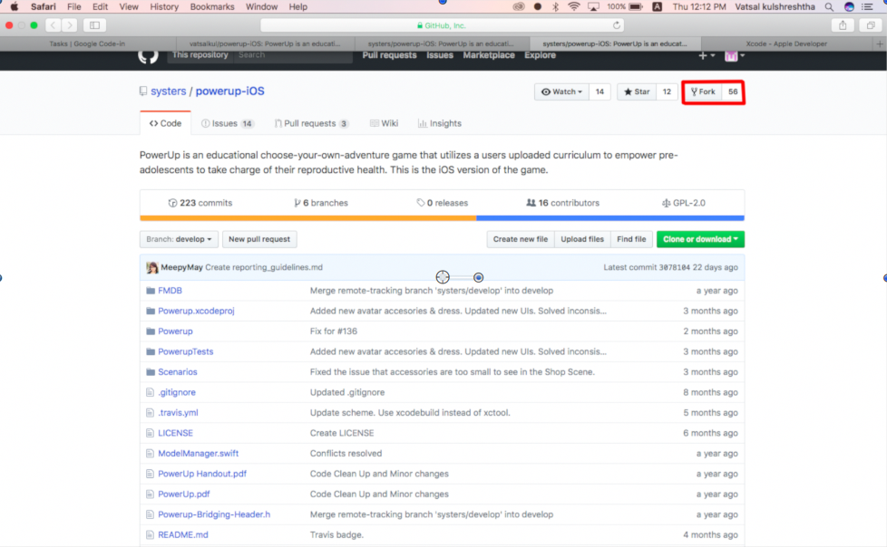
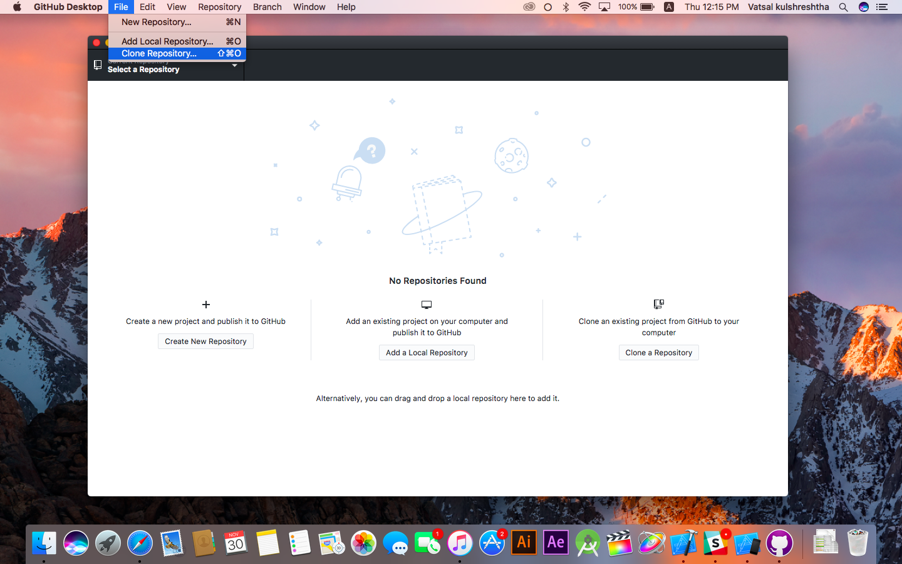
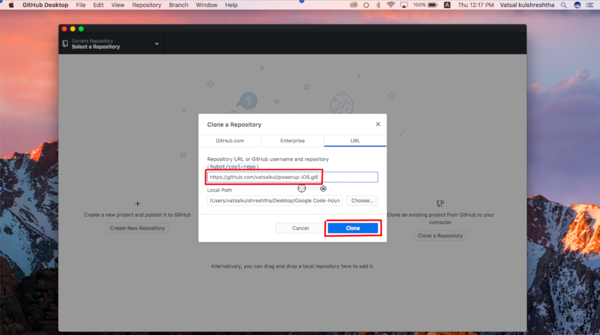
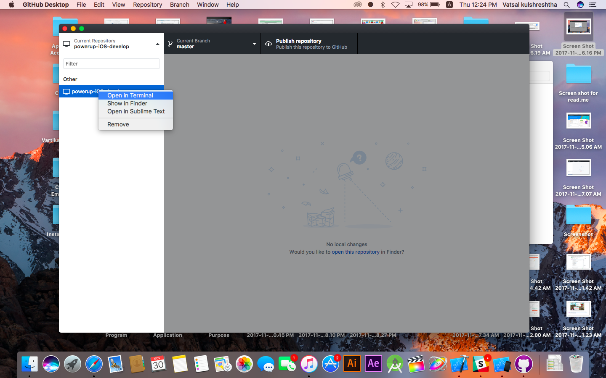
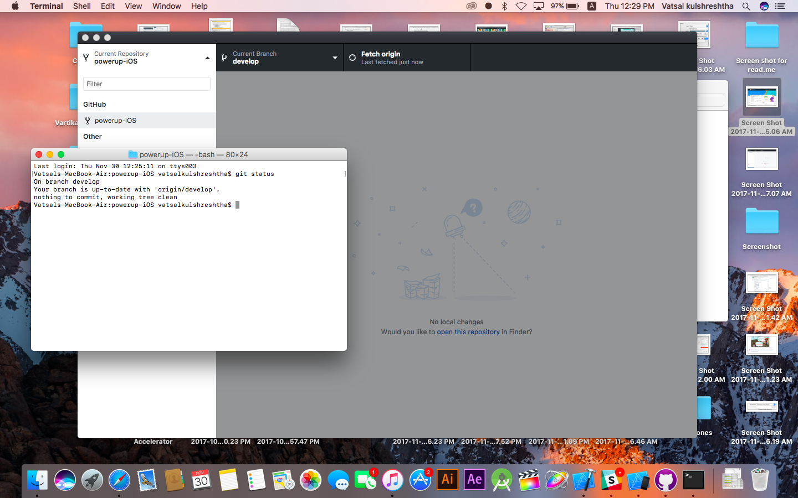
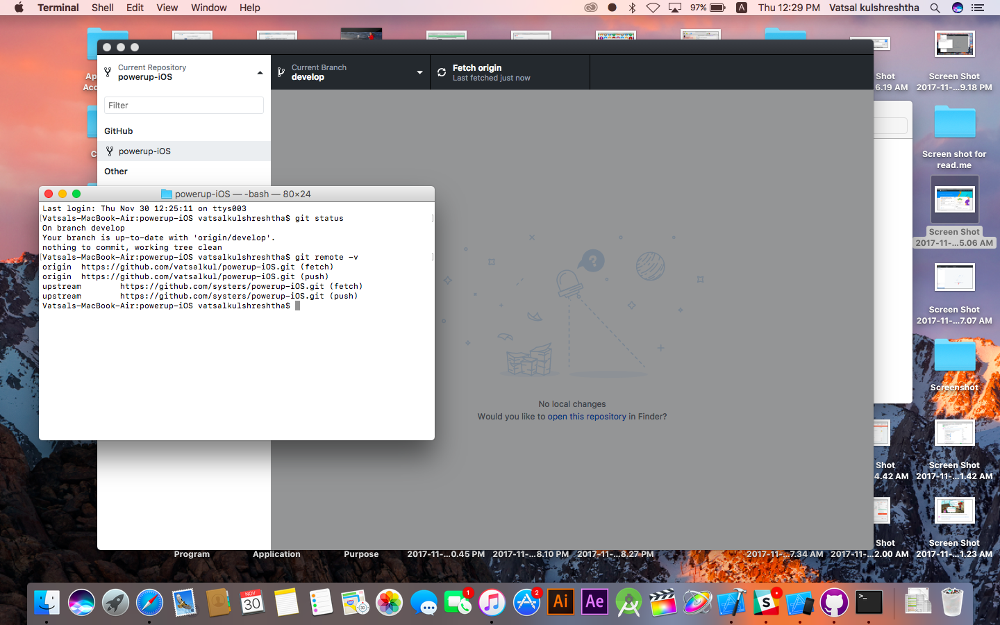
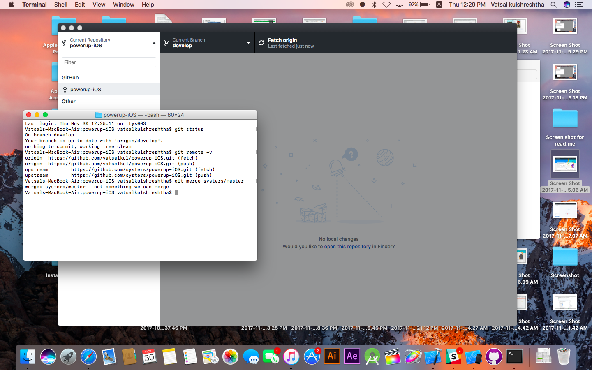

# PowerUp - iOS 

**PowerUp** is an educational mobile game app that seeks to empower young girls to take charge of their reproductive health 
and self-esteem by navigating the life of their Avatar!

## Setup for Developers
1. Make sure you have [Xcode IDE](https://developer.apple.com/xcode/) downloaded on your machine for software development for iOS. 
2. **Fork** the _systers_ project. Go to [Powerup-iOS](https://github.com/systers/powerup-iOS) and click on Fork. Fork the repo on your Github id. Make sure that you don’t have any existing repo with the same name in your profile else there will be conflicts. 
3. Make sure you have installed [Github Desktop(for Mac)](https://desktop.github.com/). Open Github Desktop, click on **Clone Repository** in File Menu. Clone the forked repo to get a local copy on your system.  
4. Get the path where you have your git repository on your machine. Go to that path in _Terminal_ using cd. Alternatively, Right click on project in Github Desktop and hit **‘Open in Terminal’**.Execute the following:   
* git status  
* git remote -v  
* git merge systers/master    
5. Project set-up is complete. For more details and additional git commands,[click here](https://docs.google.com/document/d/1N_-zmmjPn6D1H6wTdF4z66mFGT3af_FWbfGvLKkeY1w/edit#bookmark=id.lsmu7e8l1dnn). 

## Documentation of PowerUp-iOS
Links to the Documentation:  

> * 2017: [PowerUp-iOS 2017 Documentation] 
> * 2016: [PowerUp-iOS 2016 Documentation]   
> * 2015: [PowerUp-iOS 2015 Documentation]

[PowerUp-iOS 2017 Documentation]: https://docs.google.com/document/d/1-45bBWAL8oh5o_1bc42BXGDKTHlGrQW0PCN9gFtlt6U/edit?usp=sharing
[PowerUp-iOS 2016 Documentation]: https://docs.google.com/document/d/1N_-zmmjPn6D1H6wTdF4z66mFGT3af_FWbfGvLKkeY1w/edit?usp=sharing
[PowerUp-iOS 2015 Documentation]: https://docs.google.com/document/d/1WkhcVrUs-B_vlCBknNPYqxqc7_7wVrBF2pV0bKu_EiQ/edit?usp=sharing
